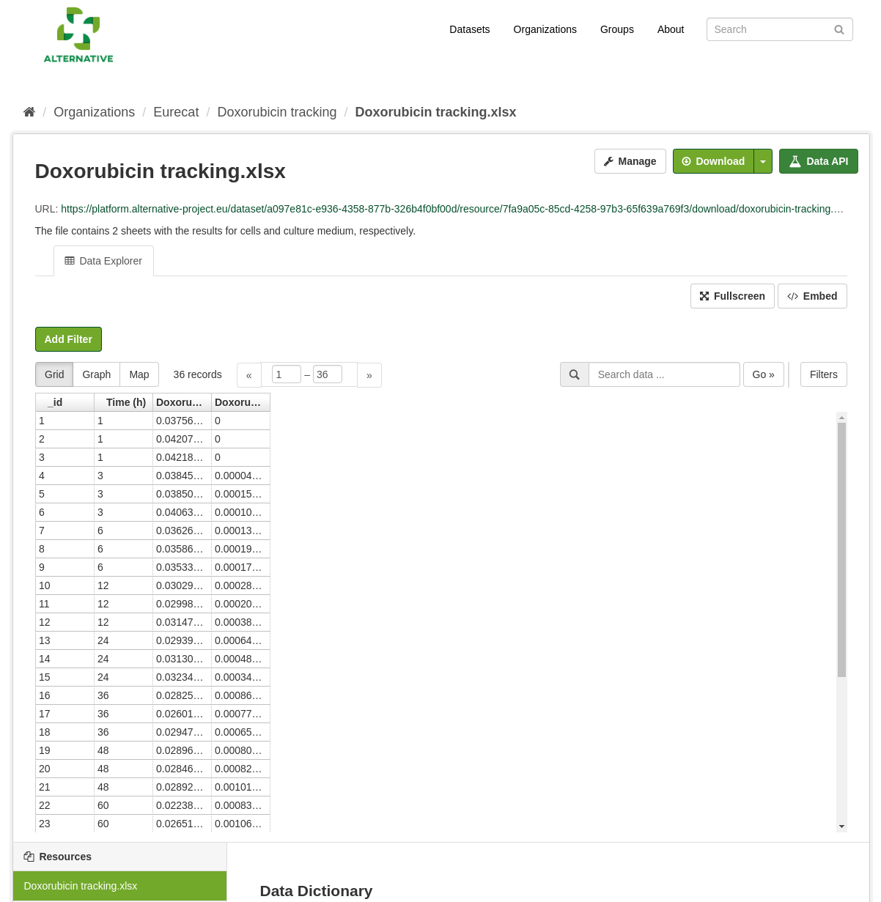
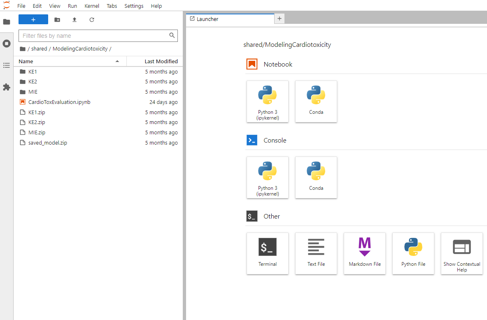

### User services
The user services are those used by users to interact directly with.

#### CKAN
The ALTERNATIVE platform’s data sharing part is based on CKAN, a web-based catalog platform for working with large datasets in a collaborative style. CKAN provides an easy to use web interface, which can be used to create, share and manage various types of data either with internal teams or external audiences. 

**Users, Organizations, and Authorization**  
The CKAN platform, integral to the ALTERNATIVE project, categorizes users into two distinct types: regular users and sysadmin users. The sysadmin users are vested with the authority to create organizations within the platform. Upon creation, an organization initially contains no datasets and has a single member, typically the user who established it. While the platform allows unregistered users to search for and access public data, registration is mandatory for engaging in publishing activities and accessing personalization features. The management of user identity and access within the CKAN platform is efficiently handled by Keycloak.

In the context of the ALTERNATIVE platform, each consortium partner is represented as an organization. These organizations possess unique workflows and authorization mechanisms, enabling them to autonomously manage their respective publishing processes. Organizations serve as the fundamental unit for controlling access to datasets. They determine who can view, create, and modify datasets within the platform. The administrative personnel within an organization have the capability to add users and assign them specific roles, each with varying levels of access and control:

- **Member Role:** Users with this role have the privilege to view private datasets owned by the organization.
- **Editor Role:** In addition to all privileges available to a Member, Editors can edit and publish datasets.
- **Admin Role:** Users in this role encompass all capabilities of an Editor, with the added responsibilities of adding, removing, and altering the roles of organization members.

This structured approach to user roles and organization management within the ALTERNATIVE platform ensures a streamlined and secure process for dataset management and publication. It allows for a tailored and controlled environment, where each organization can maintain the integrity and confidentiality of its data while facilitating collaboration and data sharing as per the project's objectives.

**Datasets, Resources and Groups**  
The ALTERNATIVE platform handles data publication through "datasets." Each dataset is a compilation of metadata describing the data, accompanied by various resources that contain the actual data. The platform is designed to be agnostic to the data format, accommodating a diverse range of resource types including, but not limited to, CSV or Excel files, XML files, PDF documents, image files, and linked data in RDF format. Resources are primarily stored in an S3 bucket within Cloud Storage, although they can also exist as external web links.

- **Dataset Exploration:** The platform provides a comprehensive interface for exploring datasets. Users can view a complete list of available datasets through the datasets menu. Access to a specific dataset is facilitated either from this list or via an organization's page. Upon selection, the dataset page is displayed, which is organized into three main tabs:
    - The 'Dataset' tab presents detailed information about the dataset, including a list of its resources. Selecting a resource redirects the user to a dedicated page where details about the resource are available for review, management, and download.
    - 
    - The ‘Groups’ tab for managing which groups of users can access the dataset.
    - The 'Activity Stream' tab chronicles the historical changes made to the dataset, providing a transparent audit trail.
- **Dataset Creation:** The process of creating a new dataset on the ALTERNATIVE platform is designed to be intuitive. Users can initiate dataset creation either from the 'Datasets' page by clicking the 'Add Dataset' button or through the 'Organisations' page by selecting the appropriate owning organization.
- 
- **Dataset Management:** Dataset management privileges are granted based on user roles and associations. A user can manage any dataset they have created, any dataset owned by an organization they are a member of, or any dataset where they are designated as a collaborator with at least an Editor role.
- **Resource Management within a Dataset:** Managing a dataset's resources is facilitated through the 'Resources' tab. Users can add new resources to a dataset using the 'Add new resource' button. Existing resources can be edited by selecting the resource and modifying its information. All changes are finalized and saved using the 'Update Resources' button.
- **Metadata:** Each dataset contains metadata, which can be defined during creation of at a later point. This metadata contains descriptive information like author, organization, license and others, which can be used when querying the platform’s datasets. For the purposes of ALTERNATIVE, CKAN has been extended via custom metadata fields grouped under “Advanced metadata for experiments”, which can be additionally defined for datasets which are part of ALTERNATIVE’s scientific base.
  

#### JupyterHub
JupyterHub is seamlessly integrated into the ALTERNATIVE platform, providing researchers and scientists an integrated development environment for working with datasets and analytical workflows.

Upon accessing the JupyterHub single sign-on URL from the web portal, authenticated users have a dedicated JupyterHub server spawned dynamically for them. This creates a personalized workspace with a rich set of tools encompassing Jupyter notebooks, text editors, terminals, code consoles, file browsers, data visualization, version control integration and more.

Jupyter Notebooks in particular are versatile documents integrating executable code, mathematical equations, graphics and interactive visualizations into a computational scratchpad. This environment facilitates both exploratory analysis over datasets available to the user as well as rapid development of reusable scripts, machine learning pipelines, models and applications by coding in languages like Python and R.

To optimize resource usage, any ephemeral notebooks servers are automatically shutdown after periods of user inactivity, while keeping any workflow outputs and snapshots preserved for future access. This balances providing responsive on-demand environments with managing platform costs efficiently at scale.

JupyterHub itself provides extensive customization options accessible after the server is provisioned for a user. Common configurations include:
- File browser pane for data and workspace asset access control integrations
- Tabbed based editor for concurrently working across documents like notebooks, code files, markdown reports etc
- Menu of terminals to manage dependencies or launch Docker environments as needed
- Sidebar of tools ranging from version control plugins, debugger, data visualization toolkit and extensions catalog
- Global user preferences from UI behavior to notebooks runtimes to visualize resource utilization
- Keyboard shortcuts for expedited navigation and frequent tasks
- Hub control panel reconnect back to central management consoles
- Github integration plugin in the sidebar

For illustrative purposes, examined below is a standard data science focused Jupyter notebook making use of many integrated capabilities:

Every JupyterHub server is being spawned with two environments from the start - default python environment and an additional conda environment. On the Launcher tab under Notebook or Console there are options to choose which environment to use. The Terminal also can be used:

- **Python Virtual Environments** - Each environment has their own independent set of Python packages installed in their site directories. A virtual environment is created on top of an existing Python installation, known as the virtual environment’s base Python, and may be isolated from the packages in the base environment, so only those explicitly installed in the virtual environment are available.
- **Conda Environments** - Each environment has their own independent set of Python or Conda packages installed.
- **Python Library** - The python library alternative-lib is designed to help with finding datasets and downloading resources from them, by using ckanapi.
- **R** - is a free software environment for statistical computing and graphics. In the ALTERNATIVE platform the R environment can be used from the Terminal.
- **Bioconductor Integration** - Bioconductor is a free toolkit that helps scientists study genes and DNA data. It offers lots of tools for analysing and visualising this information, making it easier for researchers to understand complex genetic data. People from all over the world work together to make Bioconductor better, so scientists can keep making new discoveries in genetics. Bioconductor relies on the R programming language and follows open-source principles, welcoming contributions from anyone. It's updated twice a year and has a vibrant user community. Additionally, Bioconductor can be accessed through Docker images for convenient use.

#### AI/ML API

The AI/ML API is a key component of the ALTERNATIVE platform, providing users with access to a range of machine learning models and algorithms. These models are designed to support various use cases, including data analysis, predictive modeling, and decision-making. The API is built on top of a scalable and efficient infrastructure, allowing users to run complex machine learning tasks with ease. The AI/ML API is accessible through a set of RESTful endpoints, which can be integrated into existing applications or used directly by users.
